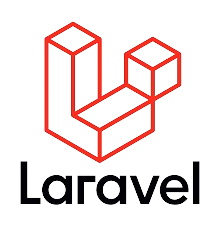
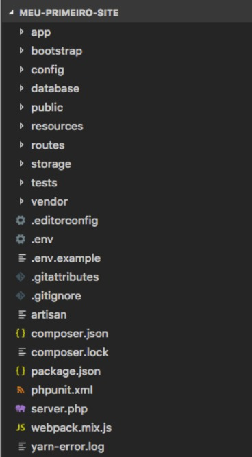
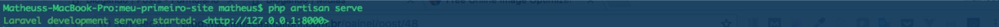
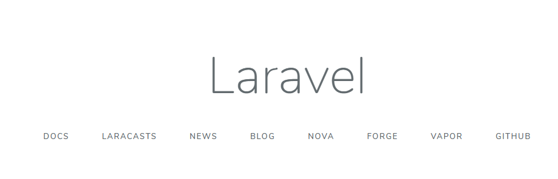
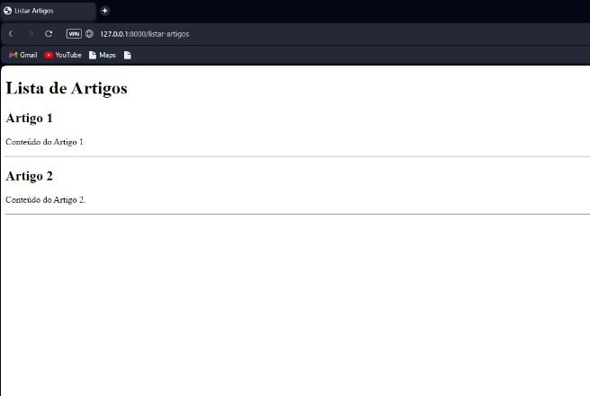

<h1 align="center"><b>Laravel</b></h1>

<b>Grupo:</b>
* [João Pedro Neffa](https://github.com/neffahr)
* [Julia Almeida Luna](https://github.com/Julialunna)
* [Lorena Ricoy Martins](https://github.com/lorenaricoy)
* [Igor Barroso Almeida](https://github.com/IgorBarrosoAlmeida)
* [Leandro Rodrigues Marques](https://github.com/leandro-rodrigueds)
<br>

## Introdução

Com o nome de “Framework PHP para os artesãos da web”, o Laravel tem diversas funcionalidades e 
recursos interessantes, resolvendo uma série de desafios comuns enfrentados por desenvolvedores 
web ao criar e manter projetos.

Algumas funções muito úteis que podemos encontrar nesse framework PHP são:
* A utilização de um sistema modular para gerenciamento de dependências, ou seja, separando-as em módulos;
* Diferentes formas de conexão;
* Acesso a banco de dados relacionais (Object-Relational Mapping ou ORM);
* Motor próprio de templates para criação de interfaces;
* Programas e serviços criados para facilitar a publicação e manutenção de sistemas criados;
* Implementação nativa do gerenciador de dependencias Composer;
* Facilita a escalabilidade do sistema;
* Workflow e completo;
* Documentação útil e organizada;
* Por ser mais popular, é mais fácil de encontrar soluções na internet;
* Outras funcionalidades como Blade, Elixir, Homestead, Migrations e Artisan.

<div align="center"></div>

Outro ponto funcional é que o framework é baseado na arquitetura MVC, ou Model-View-Controller, 
que é um padrão de arquitetura de software para reutilização de código. O nome se dá por conta 
da divisão de um sistema em 3 camadas: modelo, visão e controle. Enquanto a primeira está 
relacionada ao banco de dados, a segunda vincula-se dos dados e das páginas e a última é responsável 
pela conexão e transmissão de informações entre modelo e visão.
<br><br>

## Instalando o Laravel

Para baixar o Laravel e começar a trabalhar com ele em seu computador, você pode seguir estes passos básicos. 
Certifique-se de ter o PHP e o Composer instalados antes de começar.

### Pré-requisitos
PHP 8.2: O Laravel requer o PHP instalado em seu sistema. Você pode baixar o PHP em [php.net](https://www.php.net)

Git: Sistema de controle de versões distribuído. Baixe em [git-scm.com](https://git-scm.com)

Composer: O Composer é uma ferramenta de gerenciamento de dependências para PHP. Você pode baixar o Composer em [getcomposer.org](https://getcomposer.org).

<div align="center"></div>

### Passos para baixar o Laravel
Instale o Composer:
Siga as instruções no site do Composer para instalar a ferramenta em seu sistema.

Abra o terminal ou prompt de comando: Abra o terminal no Linux ou macOS, ou o prompt de comando no Windows.

Execute o seguinte comando para instalar o Laravel:

<code>composer global require "laravel/installer"</code>

Certifique-se que a instalação ocorreu de forma correta e você exportou o Laravel para o seu $PATH (se necessário) utilizando o comando:
 <code>laravel -v</code>
 
A versão do Laravel que foi instalada deve ser mostrada.
<br><br>

## Primeiro Projeto com Laravel

Após ter o Laravel instalado podemos começar a utilizá-lo, para criarmos um novo projeto seja
um site ou aplicação devemos utilizar o comando <code>new</code>, seguido pelo nome do projeto, por exemplo:

<code>laravel new meu-primeiro-site</code>

Aguarde o Composer realizar o download e configurar todas as dependências do projeto (isso pode demorar um pouco, depende da sua internet).

Ao término das configurações uma pasta com o nome do projeto deve ter sido criada no local 
onde você rodou o comando new, no nosso caso, uma pasta chamada meu-primeiro-site foi criada. 
Abrindo essa pasta em um editor de código (por exemplo o VS Code) podemos ver a seguinte estrutura:

<div align="center"></div>
<br>

Sim, note que tem bastante pastas e arquivos, essa é a estrutura padrão de um projeto criado com 
Laravel, cada pasta e arquivo tem sua finalidade.

### Subindo um Site

Assim como todos os outros CLI (Command-Line Interface), o Laravel também possuí um comando para 
subir o servidor do projeto, podemos fazer isso utilizando o comando:

<code>php artisan serve</code>

Onde devemos ter a seguinte resposta:



Basicamente a resposta está dizendo:

Seu servidor Laravel de desenvolvimento está rodando localmente (127.0.0.1) na porta 8000, para 
acessar o projeto vá até o endereço http://127.0.0.1:8000 em seu navegador.
Também podemos acessar via http://localhost:8000, pois, localhost seria como um “DNS” (apelido) para o IP 127.0.0.1.

Acessando o seguinte endereço em nosso navegador devemos ver algo parecido com:



### Modelando os Dados

A modelagem de dados é uma da principais partes do projeto compondo os dados e sua dinâmica.<br>
De exemplo, iremos fazer uma modelagem simples de um artigo por meio de uma classe Article, que dita o formato dos nosso dados.

Primeiro, precisamos configurar o ambiente estabelecendo uma conexão com o banco de dados. <br>
Para isso, vá no arquivo ".env" e faça as seguintes alterações:

(.env)
```
DB_CONNECTION=mysql
DB_HOST=127.0.0.1
DB_PORT=3306
DB_DATABASE=artigos
DB_USERNAME=root
DB_PASSWORD=root
```
Rode o comando <code>php artisan migrate</code> no terminal para efetivar as mudanças

#### Models

Agora, vamos modelar nosso Article.<br>
Para isso, crie o arquivo 2023_11_22_141349_create_article.php em migrations:<br>
<code>php artisan make:model Article -m</code>

Coloque os atributos desejados na nova tabela e faça a migração para que a tabela
seja criada no banco:

(database/migrations/2023_11_22_141349_create_article.php)
```
<?php

use Illuminate\Database\Migrations\Migration;
use Illuminate\Database\Schema\Blueprint;
use Illuminate\Support\Facades\Schema;

return new class extends Migration
{
    /**
     * Run the migrations.
     */
    public function up(): void
    {
        Schema::create('artigos', function (Blueprint $table) {
            $table->id();
            $table->string('titulo');
            $table->text('conteudo');
            $table->timestamps();
        });
    }

    /**
     * Reverse the migrations.
     */
    public function down(): void
    {
        Schema::dropIfExists('artigos');
    }
};
```
<code>php artisan migrate</code>

Esse comando também cria o arquivo "Article.php", modifique-o para conectar o modelo com o banco de dados:

(App/Models/Article.php)
```
<?php

namespace App\Models;

use Illuminate\Database\Eloquent\Factories\HasFactory;
use Illuminate\Database\Eloquent\Model;

class Article extends Model
{
    protected $table = 'artigos';

    protected $fillable = [
        'titulo', 'conteudo',
    ];
}
```

#### Seeders

Os Seeders são arquivos em que colocamos os dados referentes aos modelos feitos com os quais desejamos popular o banco.<br>
Para criar um Seeder "ArtigoSeeder.php" para nosso modelo de Article rode o comando:<br>
<code>php artisan make:seeder ArtigoSeeder</code>

Depois, coloque as informações que deseja dentro do arquivo e mande as instâncias para o banco de dados:

(database/seeders/ArtigoSeeder.php)
```
<?php

namespace Database\Seeders;

use Illuminate\Database\Seeder;
use Illuminate\Support\Facades\DB;

class ArtigoSeeder extends Seeder
{
    public function run()
    {
        DB::table('artigos')->truncate();

        DB::table('artigos')->insert([
            [
                'titulo' => 'Artigo 1',
                'conteudo' => 'Conteúdo do Artigo 1.',
                'created_at' => now(),
                'updated_at' => now(),
            ],
            [
                'titulo' => 'Artigo 2',
                'conteudo' => 'Conteúdo do Artigo 2.',
                'created_at' => now(),
                'updated_at' => now(),
            ],
        ]);
    }
}
```
<code>php artisan db:seed --class=ArtigoSeeder</code>

### Controller

### Criando Rotas e Views
Agora, vamos criar uma rota e uma view para a nossa aplicação.

Abra o arquivo "routes/web.php" e adicione a seguinte rota:

(routes/web.php)
```
<?php

use Illuminate\Support\Facades\Route;
/*use App\Http\Controllers\ArtigoController;

Route::resource('/artigos/index.blade', ArtigoController::class);*/
use App\Http\Controllers\ArtigoController;

Route::get('/listar-artigos', [ArtigoController::class, 'listarArtigos']);
```

Essa rota responde a uma requisição GET para "/listar-artigos" e retorna a view chamada "listarArtigos".

Agora, crie a view. Vá até a pasta "resources/views" e crie um arquivo chamado "listar-artigos.blade.php" com o seguinte conteúdo:

(resources/views/listar-artigos.blade.php)
```
<!DOCTYPE html>
<html lang="en">
<head>
    <meta charset="UTF-8">
    <meta name="viewport" content="width=device-width, initial-scale=1.0">
    <title>Listar Artigos</title>
</head>
<body>
    <h1>Lista de Artigos</h1>

    @foreach ($artigos as $artigo)
        <h2>{{ $artigo->titulo }}</h2>
        <p>{{ $artigo->conteudo }}</p>
        <hr>
    @endforeach
</body>
</html>
```

Agora, se você acessar http://seu-domínio/listar-artigos no navegador, verá o seguinte resultado:



Lembrando que este é apenas um exemplo básico. Laravel oferece muitas funcionalidades poderosas
para desenvolvimento web, como Eloquent (um ORM), Blade (um mecanismo de template), middleware,
entre outros. Essa estrutura básica pode ser expandida para criar aplicativos mais complexos.
<br><br>
      
## Ferramentas Similares

Duas ferramentas similares ao Laravel são o Symfony (PHP) e o Django (Python). Symfony é um
framework PHP robusto, amplamente utilizado para o desenvolvimento web, com uma arquitetura 
flexível e modular. Django, por outro lado, é um framework web Python que segue o princípio 
"batteries-included", oferecendo uma grande variedade de funcionalidades integradas. Ambos os 
frameworks têm comunidades ativas e são adequados para o desenvolvimento web, embora o Laravel 
se destaque pela sua elegância e sintaxe expressiva em PHP.
<br><br>

## Referencias
[https://hcode.com.br/blog/instalando-e-configurando-o-laravel-no-windows-linux-e-mac](https://hcode.com.br/blog/instalando-e-configurando-o-laravel-no-windows-linux-e-mac)

[https://www.youtube.com/watch?v=4oxjaQCJRaA](https://www.youtube.com/watch?v=4oxjaQCJRaA)

[https://www.youtube.com/watch?v=W33t7M2ZXoU&t=4s](https://www.youtube.com/watch?v=W33t7M2ZXoU&t=4s)

[https://satellasoft.com/artigo/php/como-criar-e-rodar-um-projeto-no-laravel](https://satellasoft.com/artigo/php/como-criar-e-rodar-um-projeto-no-laravel)
