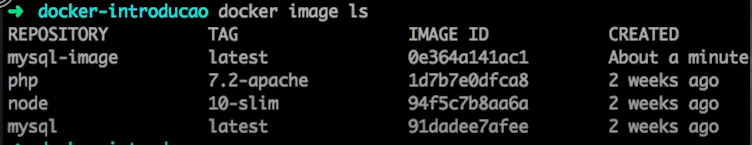
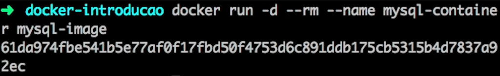

<h1 align="center">
    <strong>DOCKER, Ambiente Virtual de Desenvolvimento</strong>
</h1>

 

    

 

Link Slide: `https://www.canva.com/design/DAFRiwVuVyM/KG9EojYOpGzh9KVSXyFKhQ/edit`

<h1 align="center">
  Introdução
</h2>

É muito recorrente no ambiente de desenvolvimento de sistemas que aplicações já feitas e testadas não funcionem de maneira padronizada para diferentes máquinas, fazendo com que o seu trabalho trimestral não funcione no PC do professor e você tira aquele 5 magro, daí surgiu a famosa frase: “No meu PC funcionou, por que no seu não?”

Isso costuma acontecer, pois em diferentes máquinas, possuímos diferentes configurações e versões de diferentes softwares e ferramentas, como a linguagem  Python, o banco de dados MySQL, o APACHE e até mesmo a versão dos sistemas operacionais, como Windows, MacOS e Linux.

    
    
    

 

Diante desse problema recorrente, foi criado o software Docker como uma forma de virtualizar aplicações no conceito de “containers”, trazendo da web, exemplo mais famoso é o Docker Hub, ou de seu repositório interno uma imagem completa. Essa imagem inclui todas as dependências necessárias para executar sua aplicação, linguagens de programação, banco de dados, bibliotecas, informações do servidor, até mesmo, as referentes ao sistema operacional. Neste trabalho, abordaremos como o Docker faz isso mais a fundo.

<h1 align="center">
  Instalação & Configuração no Ubuntu
</h2>

//atualizando os repositórios existentes

`$ sudo apt-get update`

//instalando pacotes necessários para permitir que o apt use repositórios por HTTPS

`$ sudo apt-get install \
    ca-certificates \
    curl \
    gnupg \
    lsb-release`
    
//adicionando a chave GPG oficial do Docker

`$ sudo mkdir -p /etc/apt/keyrings`

`$ curl -fsSL https://download.docker.com/linux/ubuntu/gpg | sudo gpg --dearmor -o /etc/apt/keyrings/docker.gpg`

//configuração padrão do repositório

`$ echo \
  “deb [arch=$(dpkg --print-architecture) signed-by=/etc/apt/keyrings/docker.gpg] https://download.docker.com/linux/ubuntu \
  $(lsb_release -cs) stable” | sudo tee /etc/apt/sources.list.d/docker.list > /dev/null`

//Instala o Docker Engine, o containerd e o Docker Compose.

`$ sudo apt-get install docker-ce docker-ce-cli containerd.io docker-compose-plugin`

//Verifica se a instalação do Docker Engine foi bem-sucedida executando a hello-world imagem:

`$ sudo docker run hello-world`

Este comando baixa uma imagem de teste e a executa em um contêiner. Quando o contêiner é executado, ele imprime uma mensagem de confirmação e sai.

TUDO PRONTO! DOCKER INSTALADO E CONFIGURADO!

<h1 align="center">
  Getting Started
</h2>

Para começar a configurar o ambiente de desenvolvimento agora, é necessário criar um arquivo chamado DockerFile, que será responsável por definir a imagem do nosso projeto, contendo as configurações, sistema operacional, dependências, arquivos e comandos que serão utilizadas na aplicação.

    

 
Após configurar o DockerFile corretamente de acordo com as necessidades do projeto, é necessário utilizar o comando Docker build, que serve para construir a imagem do projeto que foi configurada no DockerFile.
 
 

    

 
Após isso, podemos ver as imagens disponíveis para uso com o comando Docker Image Ls;
 
 

    

 

Então finalmente, agora basta executar nossa imagem com o comando docker run.
 
 

    

 
Agora, por fim, temos o container configurado e pronto para uso, utilizando o comando docker ps, conseguimos visualizar os containers prontos para serem utilizados.
 
 

    

 

<h1 align="center">
  Ferramentas similares
</h2>

<h2 align="left">
  LXD
</h3>

    

 
 

LXD é outra engine de container de código aberto projetado especificamente para o LXC. O LXC permite que os usuários executem aplicativos em containers isolados ou ambientes virtuais semelhantes a máquinas virtuais, sem a carga técnica de gerenciar kernels individuais. Ele também fornece uma interface usada para se conectar à biblioteca de software LXC, enquanto cria um daemon responsável por lidar com a rede, armazenamento de dados e gerenciamento de vários containers LXC.

Embora o LXC possa ser executado como uma ferramenta independente, ele possui um subconjunto limitado de recursos. O LXD fornece esses recursos adicionais, portanto, depende do LXC para funcionar. No entanto, ambos operam em uma pequena subseção da ecosfera de tecnologia de container e têm um pequeno número de usuários. Eles também são mais adequados para casos de uso que requerem ambientes persistentes de longo prazo para a execução de aplicativos virtuais, em oposição àqueles que usam containers de curta duração.

<h2 align="left">
  Kaniko
</h3>

    

Kaniko é uma ferramenta de construção de imagens do Google que pode construir imagens a partir de arquivos Dockerfile, e se concentra mais na construção de imagens no Kubernetes. Ele não é muito conveniente para instâncias de desenvolvimento local, pois é geralmente executado como uma imagem com um orquestrador de containers como o Kubernetes. No entanto, para integração contínua e pipelines de entrega em um cluster Kubernetes, Kaniko pode ser um utilitário prático.

